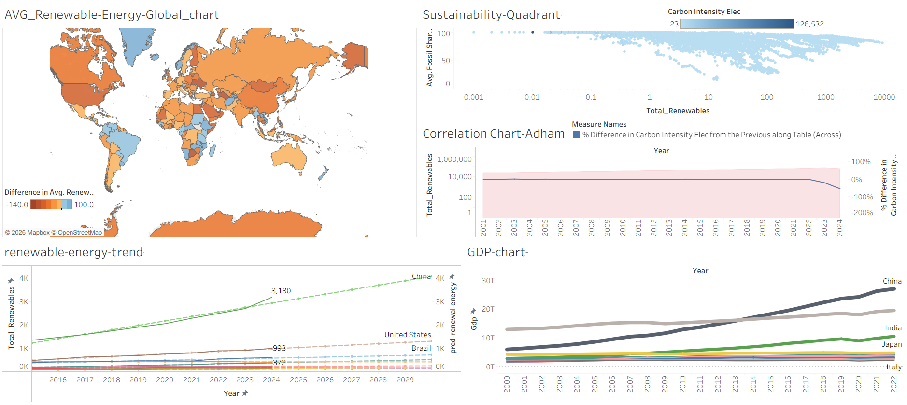
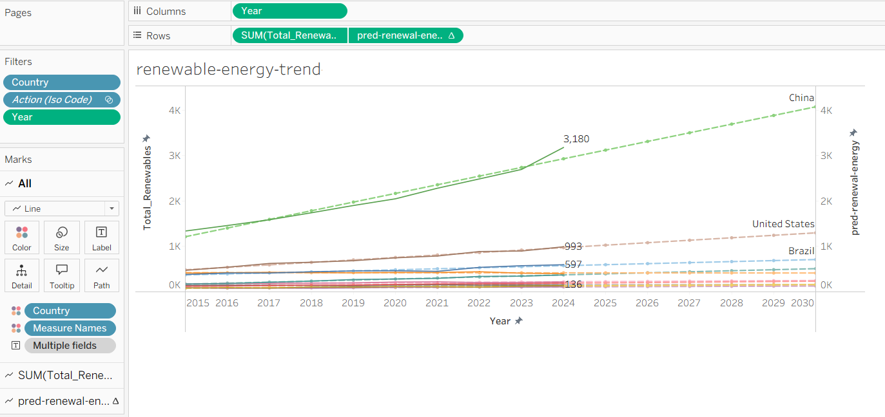

# World Energy Consumption - Predictive Analytics

## Project Overview
The project conducts a detailed examination of worldwide energy usage patterns while studying the shift toward renewable energy sources. The system uses **Tableau** to create advanced visualizations which operate through **Python (via TabPy)** to perform real-time Machine Learning predictions.
## Stack
* **Visualization:** Tableau Desktop (Packaged Workbook `.twbx`)
* **Data Integration:** TabPy (Tableau Python Server)
* **Machine Learning:** Scikit-learn (Linear Regression)
* **Dataset:** [World Energy Consumption (Kaggle)](https://www.kaggle.com/datasets/pralabhpoudel/world-energy-consumption)

## Key Features
* **Predictive Modeling:** This Python logic is deployed via TabPy and called in Tableau using the `SCRIPT_REAL` function to provide real-time predictive analytics on renewable energy datasets.
* **Global Insights:** Analyzes consumption trends across different countries and energy types (Solar, Wind, Hydro, etc.).
* **Dynamic Forecasting:** Integrated Linear Regression models that recalculate based on selected dimensions and filters.

## 🔍 Visual Insights & Predictions

Below are snapshots of the interactive dashboard and the predictive engine in action:

### 1. Main Analytics Dashboard

*view of global renewable energy consumption trends.*

### 2. Predictive Curve (Linear Regression)

*Real-time forecasting implemented using TabPy showing the growth trajectory of renewables.*

## Repository Structure
* `World_Energy_Analysis.twbx`: The complete Tableau Packaged Workbook (includes data and visualizations).
* `Predictive_Model.py`: Clean Python script containing the Linear Regression logic used by TabPy.
* `Data_Source_Link.txt`: Reference link to the Kaggle dataset used.

---
**Author:** Adham Rashad Abdelmoneem 
*Data Analytics MSc Candidate*
